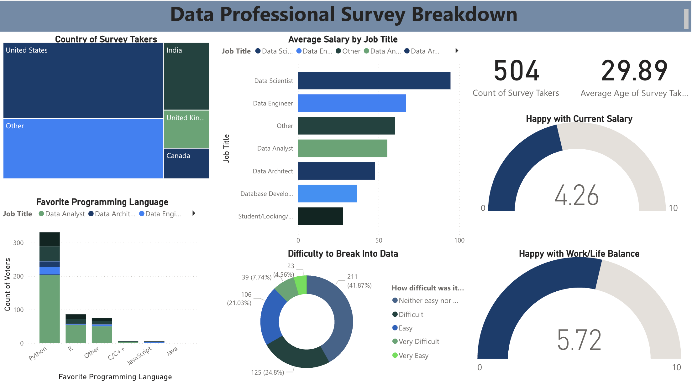

# Data Professional Survey Dashboard 📊

This project is a Power BI interactive dashboard built to analyze survey responses from data professionals around the world. The survey covers areas like salary, job roles, satisfaction, and programming preferences.

---

## 📌 Dashboard Overview

### Key Metrics Visualized:
- **Survey Participation**: 504 responses from countries like the USA, India, UK, and more.
- **Average Salary by Role**: Visual breakdown across roles like Data Scientist, Analyst, Engineer, Architect, etc.
- **Job Satisfaction Metrics**:
  - Average salary satisfaction: **4.26 / 10**
  - Work-life balance: **5.72 / 10**
- **Programming Preferences**: Python leads significantly, followed by R and others.
- **Entry Difficulty**: Most respondents found it either **neutral** or **difficult** to break into data roles.

---

## 💡 Features

- **Interactive filters** for job title and programming language.
- **Visual variety** using bar charts, donut charts, tree maps, and gauges.
- Responsive layout optimized for user-friendly exploration.

---

## 🛠 Built With

- **Power BI Desktop**
- **Power BI DAX & Power Query**
- Custom visuals and slicers for interaction.

---

## 🚀 How to View

1. Open it with [Power BI Desktop or Web](https://app.powerbi.com/groups/me/reports/8bd50852-81a8-4c11-8780-a40626bfa8cb/3aaf2d03390fcea4ba45?experience=power-bi)).
2. Interact with filters, slicers, and explore the dashboard!

---

## 📬 Contact

Feel free to connect or provide feedback:

- **Name**: Prajwal Kusha
- **LinkedIn**: [LinkedIn](www.linkedin.com/in/prajwal-kusha)
- **Email**: [prajwalkusha.uni@gmail.com](url)

---

## 📄 License

This project is open source under the [MIT License](LICENSE).
